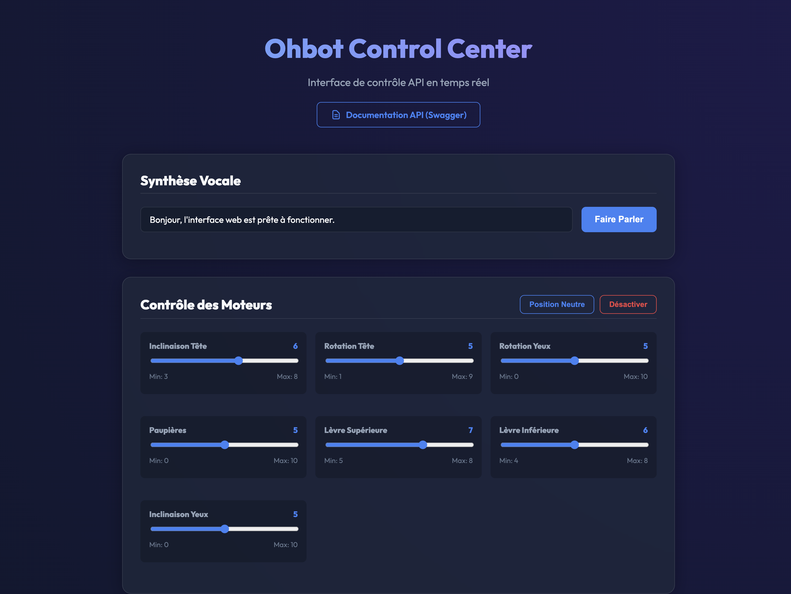

# Ohbot 2.2 Control Center 🤖


Une API moderne et une superbe interface web "premium" pour contrôler la tête robotique **Ohbot 2.2**. 

Ce projet a été conçu pour tourner de manière optimale sur un **Raspberry Pi** (ou n'importe quel ordinateur, comme un Mac) pour piloter l'Ohbot en réseau local via des requêtes HTTP simples.

> **Aperçu de l'interface web (Control Center)**
> 
> 
> *(Note: N'oubliez pas d'ajouter votre propre capture d'écran nommée `screenshot.png` à la racine de votre projet !)*

## ✨ Fonctionnalités

- 🌐 **Interface Web Intuitive** : Un panneau de contrôle au design *glassmorphism* accessible depuis n'importe quel navigateur.
- 🎛️ **Contrôle des Moteurs Dynamique** : Les limites des servomoteurs (min/max) sont éditables directement depuis l'interface web (éditeur JSON intégré) pour calibrer et protéger votre robot en temps réel.
- 🗣️ **Synthèse Vocale (Text-To-Speech)** : Faites parler Ohbot simplement en tapant du texte.
- 🚀 **Architecture API Propre (FastAPI)** : Remplace les numéros de moteurs abstraits par des clés de texte compréhensibles (`head_nod`, `lid_blink`, `top_lip`, etc.).
- 🛠️ **Sécurité Anti-Casse** : L'API rejette toute commande hors des limites que vous avez fixées pour chaque servomoteur, évitant de forcer sur les butées plastiques.

## 📦 Matériel Requis

- Un robot **Ohbot 2.2** (assemblé).
- Un **Raspberry Pi** (modèle 3, 4 ou 5 fortement conseillé) ou un ordinateur avec deux ports USB libres (un pour la communication, un pour la puissance des moteurs vers la carte Ohbrain).

## 🚀 Installation & Lancement

1. **Clonez le projet**
   ```bash
   git clone https://github.com/icamee76/projetOhbot.git
   cd projetOhbot
   ```

2. **Créez un environnement virtuel et installez les dépendances**
   ```bash
   python3 -m venv venv
   source venv/bin/activate
   pip install -r requirements.txt
   ```

3. **Lancez le serveur API**
   ```bash
   uvicorn main:app --host 0.0.0.0 --port 8000 --reload
   ```

4. **Ouvrez le Panneau de Contrôle**
   - Allez sur `http://localhost:8000` depuis votre navigateur web pour accéder à l'interface de pilotage.
   - La documentation technique (Swagger UI) est générée automatiquement et permet de tester l'API sur `http://localhost:8000/docs`.

## ⚠️ Avertissement : Bug des accents (Français) avec la librairie officielle

Si vous installez la librairie officielle Ohbot `ohbot` (via `pip`) sur un système Mac ou Linux, sachez qu'il y a un bug dans leur code source Python : ils suppriment via une regex restrictive tous les accents ("é", "à", etc.) avant la synthèse vocale, ce qui altère la prononciation française ("émilie" devient "milie").

**Correction manuelle (Patch) :**
Ouvrez le fichier de la librairie dans votre environnement virtuel (ex: `venv/lib/python3.X/site-packages/ohbot/ohbot.py`).
Cherchez la ligne contenant cette expression régulière (autour de la ligne 430 et 470) :
```python
safetext = re.sub(r'[^ .a-zA-Z0-9?\']+', '', text)
```

Remplacez-la par celle-ci pour inclure les caractères accentués (`À-ÿ`) :
```python
safetext = re.sub(r'[^ .a-zA-ZÀ-ÿ0-9?\']+', '', text)
```

## 🔧 Architecture de la Configuration (`config.json`)

Le fichier `config.json` définit tous les moteurs, leurs noms internes (clés d'URL), et surtout leurs limites (0 à 10) pour éviter la casse matérielle. Si vous modifiez ce fichier via l'interface web, les changements de limites sont pris en compte instantanément par l'API sans nécessiter de redémarrage !

---

## 📖 Documentation de l'API

L'API est documentée automatiquement et testable via l'interface Swagger sur `/docs`, mais voici les routes principales si vous souhaitez intégrer Ohbot dans vos propres scripts (Python, Node.js, cURL...) :

### 1. Synthèse Vocale
Fait parler le robot. Le mouvement des lèvres se synchronise automatiquement avec le son généré par la synthèse vocale.
**`POST /say`**
```json
{
  "text": "Bonjour, je suis prêt !"
}
```
*Exemple cURL :*
```bash
curl -X 'POST' 'http://127.0.0.1:8000/say' -H 'Content-Type: application/json' -d '{"text": "Hello world"}'
```

### 2. Mouvement des Moteurs
Bouge un moteur spécifique à une position donnée. 
- `{motor_key}` : L'identifiant textuel du moteur (ex: `head_nod`, `head_turn`, `top_lip`, etc. défini dans `config.json`).
- `{position}` : Valeur entière (généralement entre `0` et `10`).
**`POST /move/{motor_key}/{position}`**
*Exemple cURL :*
```bash
curl -X 'POST' 'http://127.0.0.1:8000/move/head_turn/8'
```
*(Sécurité : Si la position demandée dépasse les limites fixées dans la configuration, l'API renverra une erreur HTTP 400 Bad Request et protègera le moteur physique).*

### 3. Gestion de la Configuration
Récupérer ou mettre à jour les limites des moteurs à la volée.
- **`GET /config`** : Retourne le JSON complet contenant tous les moteurs et leurs limites actuelles.
- **`POST /config`** : Écrase la configuration actuelle (en mémoire et sur le disque) avec un nouveau JSON.

### 4. Fonctions d'urgence
- **`POST /reset`** : Remet tous les moteurs dans leur position neutre (généralement au centre, valeur 5).
- **`POST /shutdown`** : Désactive tous les servomoteurs (les relâche) et ferme proprement la connexion avec la carte. Utile à la fin de l'utilisation.
